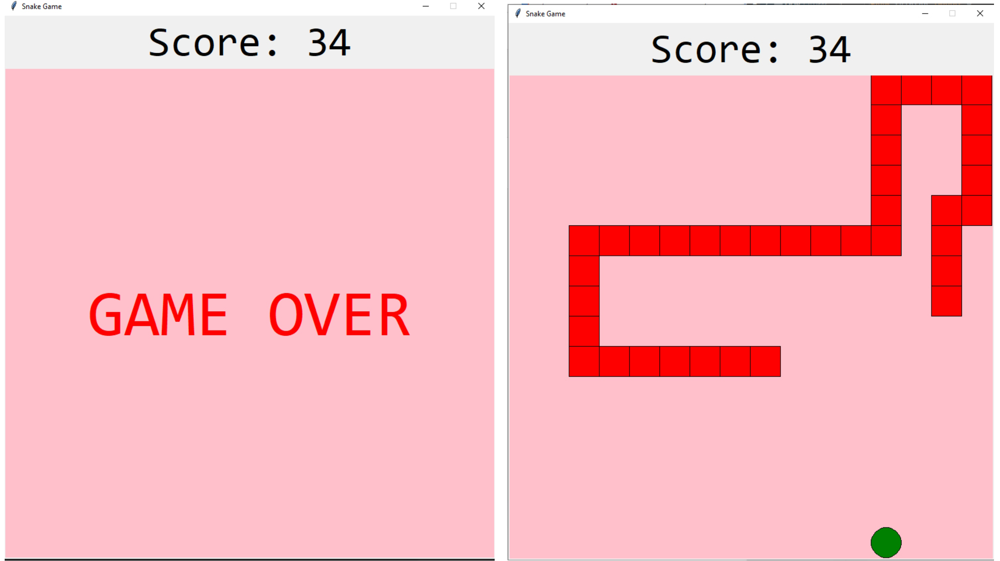

# Snake Game

This is a simple Snake game built using Python and the Tkinter library.

## Game Details
- **Game Window**: Set to a width of 800 and a height of 800 pixels.
- **Game Speed**: Runs at a speed of 100 milliseconds per frame.
- **Space Size**: Each game square measures 50x50 pixels.
- **Snake Color**: Represented by red squares.
- **Food Color**: Food items are depicted as green circles.
- **Background Color**: The game's background has a pink theme.

## How to Play
- **Controls**: Use the arrow keys (Left, Right, Up, Down) to control the snake's direction.
- **Objective**: The goal is to collect the green food items by moving the snake over them.
- **Score**: The game keeps track of your score, displayed at the top.
- **Game Over**: The game ends when the snake collides with the window boundaries or itself.

## Installation and Usage
1. Ensure to have Python installed.
2. Run the game by executing the `snake_game.py` script.
3. Use the arrow keys to control the snake's direction.

## How It Works
- **Importing Libraries**: The code imports the tkinter library for creating the GUI and the random library to generate random food positions.
- **Game Constants**: Constants control the game's dimensions, speed, and appearance.
- **Snake Class**: Initializes the snake's properties and creates a graphical representation of the snake.
- **Food Class**: Generates food for the snake and creates food objects on the canvas.
- **next_turn Function**: Defines the game logic, including moving the snake, handling collisions, and updating the score.
- **change_direction Function**: Updates the snake's direction based on player input.
- **check_collisions Function**: Checks for collisions with boundaries or itself to game over.
- **game_over Function**: Displays a "GAME OVER" message when the game ends.
- **Setting Up the GUI**: Sets up the tkinter window, canvas, and key bindings for arrow key input.
- **Initial Game Setup**: Creates Snake and Food objects and initiates the game loop.

## Project Files
- `snake_game.py`: The source code for the Classic Snake game.
- `snake_game_screenshot.png`: A screenshot of the Classic Snake game in action.

This project is a simple exercise in creating a classic Snake game using Python and Tkinter.
